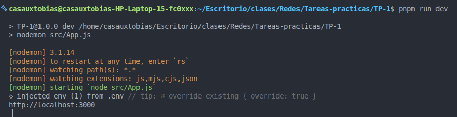
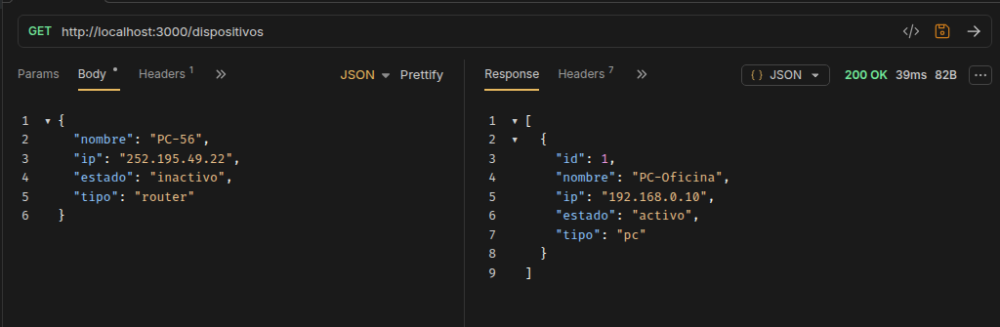
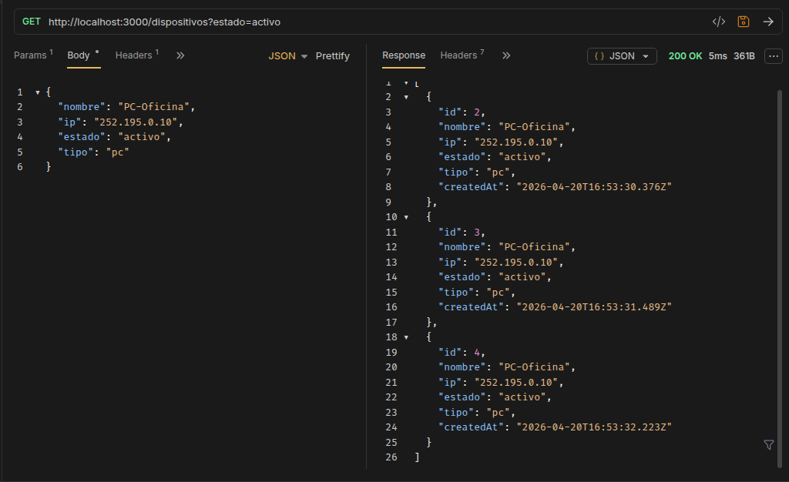
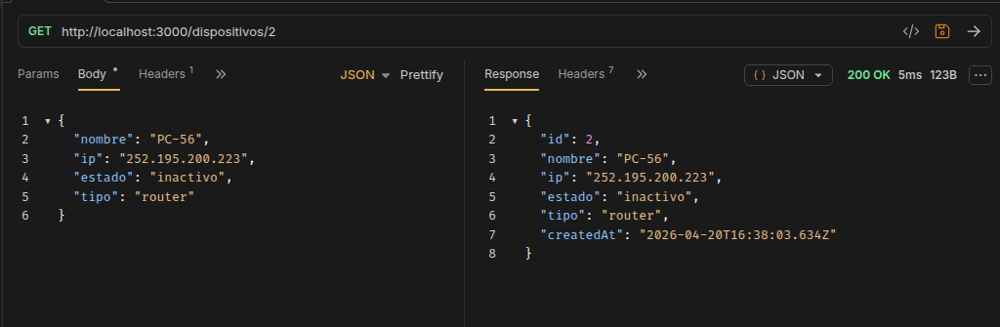
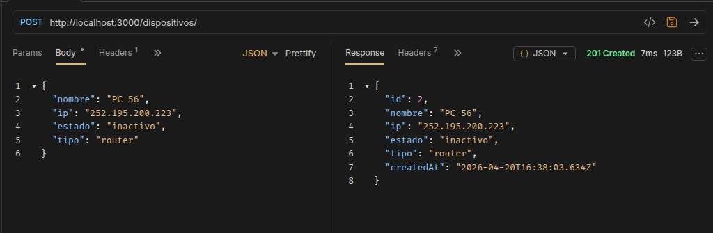
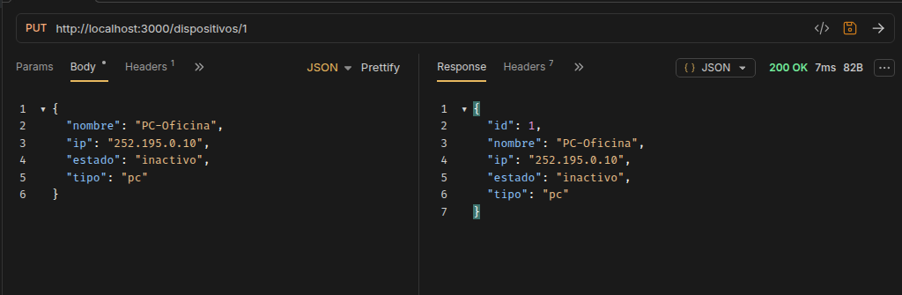
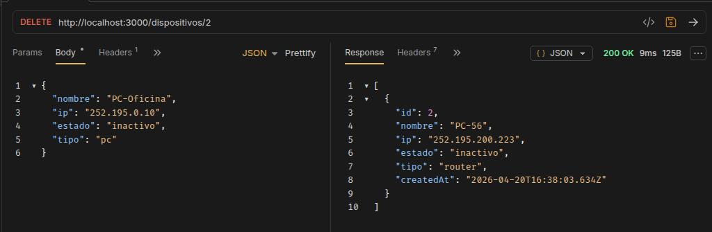
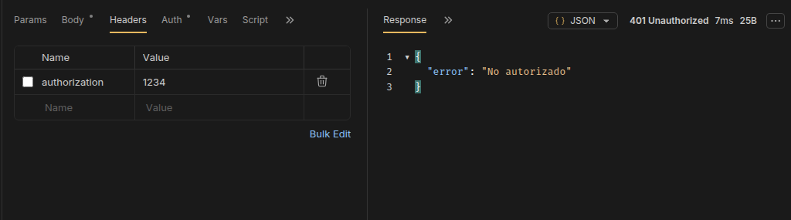

# Registro de Dispositivos

Este proyecto consiste en el desarrollo de una API REST utilizando Node.js y Express.
El sistema permite registrar, consultar, actualizar y eliminar distintos dispositivos.

---

### Tecnologías utilizadas:

- Node.js  
- Express  
- Nodemon  

---

### Cómo ejecutar el proyecto

Aclaracion: este proyecto se uso el manager de node pnpm

Instalar dependencias:

pnpm install / npm install

Crear un archivo `.env` en la raíz del proyecto con el siguiente contenido:

PORT=3000

Ejecutar el servidor:

pnpm run dev / npm run dev

---

### Endpoints

**Obtener todos los dispositivos**  
GET /dispositivos

**Obtener todos los dispositivos por Estado**  
GET /dispositivos?estado=estado

**Obtener un dispositivo por ID**  
GET /dispositivos/:id

**Crear un dispositivo**  
POST /dispositivos

**Actualizar un dispositivo**  
PUT /dispositivos/:id

**Eliminar un dispositivo**  
DELETE /dispositivos/:id

---

### Middlewares

Se implementaron dos middlewares:

- logs: muestra en consola el método, la ruta y el momento en que se realiza cada request.  
- validarObjeto: valida los datos recibidos en POST y PUT (nombre, IP y tipo).  
- authorization: verifica que el header `Authorization` tenga el valor `1234` antes de acceder a cualquier ruta.

---

### Validaciones

- El nombre no puede estar vacío  
- La IP debe tener un formato válido  
- El tipo es obligatorio  

---

Los datos se almacenan en un array en memoria.

---

### Extras

- Búsqueda por estado: `GET /dispositivos?estado=activo`
- Middleware de autenticación: header `Authorization: 1234`
- `createdAt`: cada dispositivo registra la fecha y hora exacta de su creación

---

### Decisiones de diseño

- Se utilizó express.Router() para organizar las rutas.  
- Se separaron las validaciones en un middleware para mantener el código ordenado.  
- Se asigna el estado "activo" por defecto en caso de no enviarse en la creación.